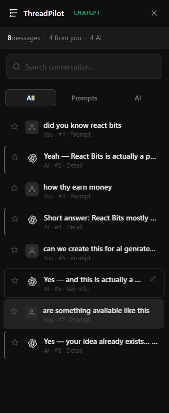

# ThreadPilot

**A smart sidebar navigator for ChatGPT, Gemini, and Claude.**

ThreadPilot is a Chrome extension that automatically indexes your long AI conversations and generates a clean, interactive sidebar. It extracts your prompts and the AI's responses, letting you jump to any specific message instantly without endless scrolling.

 

## Features

- **Universal Support:** Works seamlessly across ChatGPT, Google Gemini, and Anthropic Claude.
- **Smart Indexing:** Automatically generates concise titles for your messages based on context.
- **Visual Categorization:** Color-coded edge lines instantly tell you what kind of message it is:
  - **Question:** Prompts containing questions
  - **Key Info:** Messages containing bulleted or numbered lists
  - **Detail:** Extra-long, comprehensive AI responses
- **Save & Star:** Pin your most important messages or favorite prompts using the Star button.
- **Custom Titles:** Hover over any message in the sidebar to rename it to something memorable.
- **Light & Dark Mode:** Fully supports both themes, matching your preferred aesthetic.
- **Filtering & Search:** Easily search for a specific keyword or filter by "Prompts only" or "AI only".

## License

Distributed under the MIT License.
